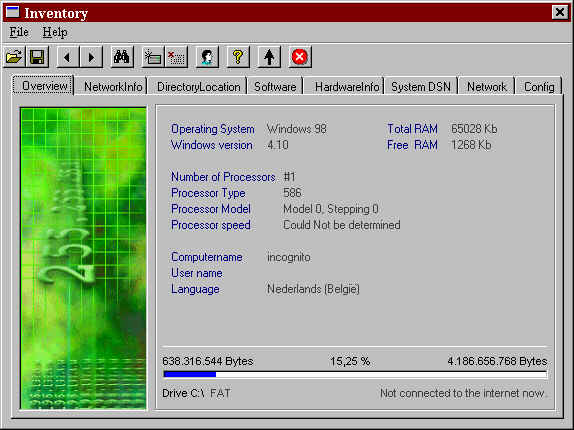



## Inventory

### Description

System, Hardware, Administrator? In order to make this program good, i need you, friends online! I see this project big, but I need your help.. mail me some nice things and i give you the end_result.....

95'98'NT works fine - pleace help me with 2000

The end_goal of this project is to run the program when users logon to a lan_network and write up_to_date information into a database!

angeldust@be.packardbell.org
 
### More Info
 
95'98'NT - help me with 2000

I would like to have this project on a server and reach all networkinfo and harwareinfo in a database.......... if you can help me....... email me: Angeldust@be.packardbell.org

some win95's give's an error I can't handle

             |
---                |---
**Submitted On**   |2000-03-31 16:07:00
**By**             |[the\_firm](https://github.com/Planet-Source-Code/PSCIndex/blob/master/ByAuthor/the-firm.md)
**Level**          |Advanced
**User Rating**    |4.9 (59 globes from 12 users)
**Compatibility**  |VB 5\.0, VB 6\.0
**Category**       |[Miscellaneous](https://github.com/Planet-Source-Code/PSCIndex/blob/master/ByCategory/miscellaneous__1-1.md)
**World**          |[Visual Basic](https://github.com/Planet-Source-Code/PSCIndex/blob/master/ByWorld/visual-basic.md)
**Archive File**   |[CODE\_UPLOAD44253312000\.zip](https://github.com/Planet-Source-Code/the-firm-inventory__1-6905/archive/master.zip)

### API Declarations

too much

